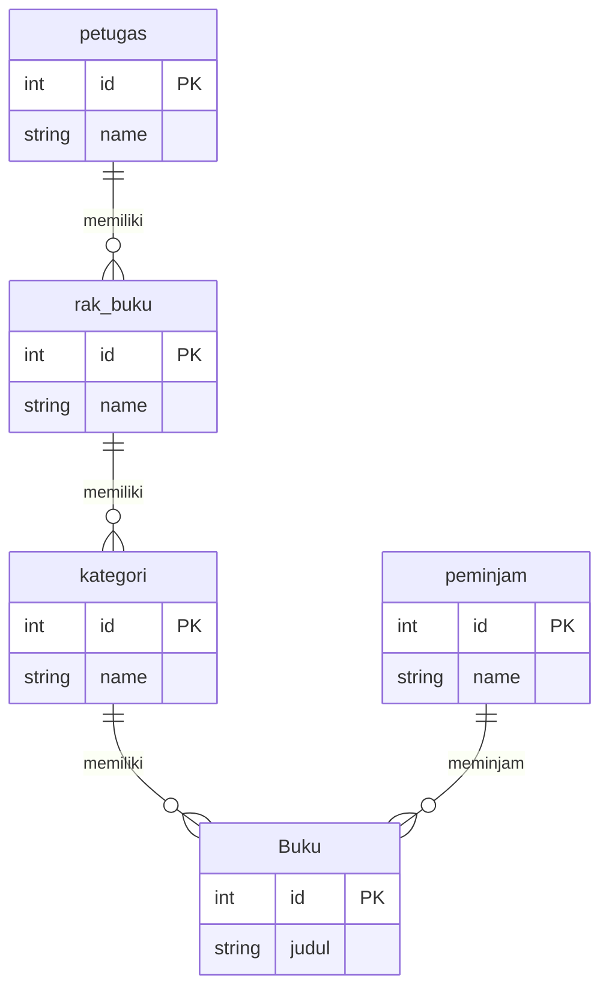

```mermaid

erDiagram
Buku {
    int id PK
    string judul
}

kategori {
    int id PK
    string name
}

rak_buku {
    int id PK
    string name
}

petugas {
    int id PK
    string name
}

peminjam {
    int id PK
    string name
}

rak_buku ||--o{kategori : memiliki

kategori ||--o{Buku : memiliki

petugas ||--o{rak_buku : memiliki

peminjam ||--o{Buku : meminjam

```
