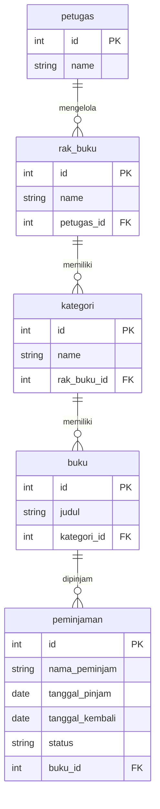

```mermaid

erDiagram
    petugas {
        int id PK
        string name
    }

    rak_buku {
        int id PK
        string name
        int petugas_id FK
    }

    kategori {
        int id PK
        string name
        int rak_buku_id FK
    }

    buku {
        int id PK
        string judul
        int kategori_id FK
    }

    peminjaman {
        int id PK
        string nama_peminjam
        date tanggal_pinjam
        date tanggal_kembali
        string status
        int buku_id FK
    }

    petugas ||--o{ rak_buku : mengelola
    rak_buku ||--o{ kategori : memiliki
    kategori ||--o{ buku : memiliki
    buku ||--o{ peminjaman : dipinjam

```
